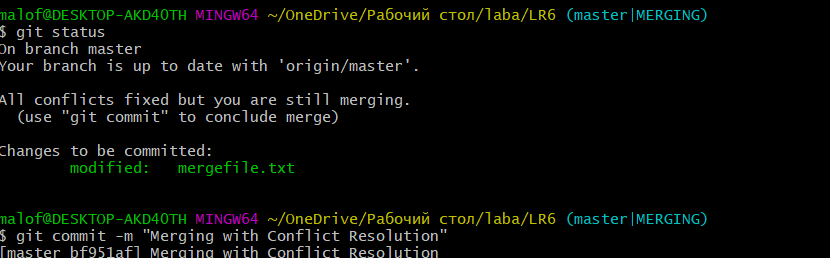
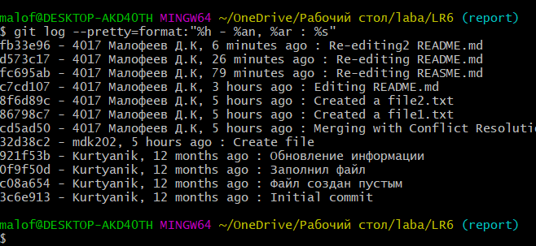

# LR6
Лабораторная работа №6

1. Делаем копию удаленного репозитория

2. Задаем имя пользователя и email

3. Клонируем удаленный репозиторий на компьютер

4. Добавляем файл через интерфейс Github

5. Подтянем изменения в локальный репозиторий

6. Получим историю операций и изменений для каждой из веток

7. Слияние и разрешение конфликта
> 1) Выполняем слияние и получаем сообщение о конфликте, выясняем причину
> 
> 2) Разрешаем конфликт
> 
> 
> 3) Добавляем рабочий каталог в индекс для последующего коммита
> 
> 4) Смотрим, исправлена ли ошибка и делаем коммит
> 
8. Удаляем побочную ветку после успешного слияния

9. Создаем изменения и делаем коммит с комментариями. Создавать будем 2 текстовых файла прямо в терминале с помощью команды echo. 

10. Сделаем «хард» откат коммита.

11. Создаем ветку для отчета и переходим в нее 

12. Получена история изменений в сокращенном виде

# Лог команд
git config global user.name/email

git clone https://github.com/mdk202/LR6

git pull

git log 

git checkout branch1

git merge branch1

git status

git add mergefile.txt

git commit -m "Merging with Conflict Resolution"

git branch -d  branch1

echo some_text  > file1.txt

git add file1.txt

git commit -m "Created a file1.txt"

echo some_text  > file2.txt

git add file2.txt

git commit -m "Created a file2.txt"

git reset --hard 8f6d89c

git branch report

git checkout report

git branch

git push origin otchet

git log --pretty=format:"%h - %an, %ar : %s"

13.После завершения отчета изменения закомиченны и запушены в репозиторий